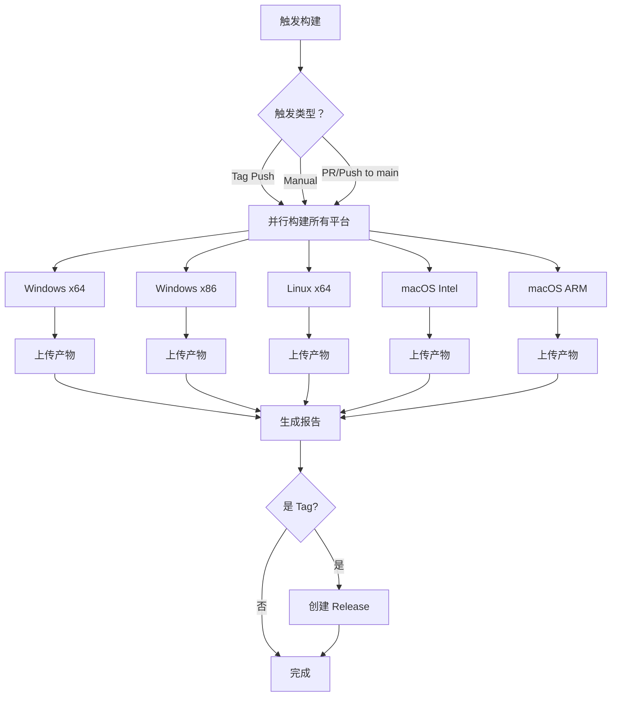

# 多平台自动打包指南

## 📦 概述

本项目使用 GitHub Actions 自动为不同操作系统和架构构建可执行文件。

### 支持的平台

| 平台 | 架构 | 文件格式 | 状态 |
|------|------|----------|------|
| **Windows** | x64 (64-bit) | .exe | ✅ 自动构建 |
| **Windows** | x86 (32-bit) | .exe | ✅ 自动构建 |
| **Linux** | x64 (64-bit) | .tar.gz | ✅ 自动构建 |
| **macOS** | Intel (x64) | .dmg | ✅ 自动构建 |
| **macOS** | ARM (M1/M2) | .dmg | ✅ 自动构建 |

## 🚀 触发方式

### 1. 版本发布（推荐）

推送版本标签时自动构建所有平台并创建 Release：

```bash
# 打标签
git tag v1.0.0

# 推送到 GitHub
git push origin v1.0.0
```

### 2. 手动触发

1. 访问 https://github.com/kxgx/OpenMicroManipulatorGUI/actions
2. 选择 "Multi-Platform Build" 工作流
3. 点击 "Run workflow"
4. 选择分支（默认 main）
5. 点击绿色按钮开始构建

### 3. 自动触发

- 推送到 main 分支时自动构建（用于测试）
- Pull Request 时自动构建（用于验证）

## 📥 下载构建产物

### 从 Releases 下载（正式版本）

1. 访问 https://github.com/kxgx/OpenMicroManipulatorGUI/releases
2. 选择对应版本
3. 下载适合你系统的文件

### 从 Actions 下载（测试版本）

1. 访问 https://github.com/kxgx/OpenMicroManipulatorGUI/actions
2. 选择对应的工作流运行
3. 在页面底部的 "Artifacts" 区域下载

## 🔧 构建配置

### Windows

```yaml
build-windows:
  - Python 3.10 (x64)
  - PyInstaller
  - 输出：OpenMicroManipulator.exe
```

### Linux

```yaml
build-linux:
  - Python 3.10 (x64)
  - PyInstaller + tar.gz 压缩
  - 输出：OpenMicroManipulator-Linux-x64.tar.gz
```

### macOS

```yaml
build-macos:
  - Python 3.10 (Intel/ARM)
  - PyInstaller + DMG 打包
  - 输出：OpenMicroManipulator-macOS-*.dmg
```

## 📝 工作流程详解

### 完整流程



### 构建时间估算

| 平台 | 预计时间 |
|------|----------|
| Windows x64 | ~5-8 分钟 |
| Windows x86 | ~5-8 分钟 |
| Linux x64 | ~3-5 分钟 |
| macOS Intel | ~8-12 分钟 |
| macOS ARM | ~8-12 分钟 |

**总时间**: 并行执行，约 8-12 分钟完成所有平台

## 🎯 版本发布流程

### 步骤 1: 准备发布

确保代码已准备好发布：

```bash
# 切换到 main 分支
git checkout main

# 拉取最新代码
git pull origin main

# 运行本地测试
python source/main.py
```

### 步骤 2: 确定版本号

遵循语义化版本规范 (SemVer):

- `v1.0.0` - 主版本（重大更新）
- `v1.1.0` - 次版本（新功能）
- `v1.1.1` - 补丁版本（bug 修复）

### 步骤 3: 打标签并推送

```bash
# 打标签（带注释）
git tag -a v1.0.0 -m "Release version 1.0.0 - AI optimized startup"

# 推送到 GitHub
git push origin v1.0.0
```

### 步骤 4: 等待自动构建

GitHub Actions 会自动：
1. ✅ 检测新的 tag
2. ✅ 并行构建所有平台
3. ✅ 创建 GitHub Release
4. ✅ 上传所有平台的安装包

### 步骤 5: 检查 Release

访问 https://github.com/kxgx/OpenMicroManipulatorGUI/releases 查看：
- ✅ 所有平台的安装包
- ✅ 自动生成发布说明
- ✅ 下载链接

## ⚙️ 自定义配置

### 修改 build.spec

如果需要调整打包配置，编辑 `source/build.spec`:

```python
exe = EXE(
    ...
    name='OpenMicroManipulator',  # 修改名称
    icon='icon.ico',              # 添加图标
    console=False,                # 是否显示控制台
)
```

### 添加新的平台

在 `.github/workflows/build.yml` 中添加新的 job:

```yaml
build-ubuntu-arm:
  name: Build Ubuntu ARM
  runs-on: ubuntu-latest
  
  steps:
    - uses: actions/checkout@v4
    - name: Set up Python
      uses: actions/setup-python@v5
      with:
        python-version: '3.10'
        architecture: 'arm64'
    # ... 更多步骤
```

## 🐛 故障排除

### 构建失败

#### 问题：Python 依赖安装失败

**解决**:
```yaml
# 在 build.yml 中添加
- name: Install system dependencies (Linux)
  run: |
    sudo apt-get update
    sudo apt-get install -y python3-dev
```

#### 问题：PyInstaller 打包失败

**解决**:
```yaml
# 添加调试信息
- name: Debug build
  run: |
    pip list
    pyinstaller --version
```

### 产物缺失

#### 问题：某些文件未生成

**检查**:
1. 查看构建日志中的错误
2. 确认 `build.spec` 配置正确
3. 检查文件路径是否正确

### macOS 签名问题

如果在 macOS 上运行时提示"无法打开"：

```bash
# 移除隔离属性
xattr -cr /Applications/OpenMicroManipulator.app
```

## 📊 构建历史

查看所有构建记录：
https://github.com/kxgx/OpenMicroManipulatorGUI/actions

## 🔐 安全建议

### 不要提交的内容

- ❌ API Keys
- ❌ 密码
- ❌ 私钥
- ❌ 个人敏感信息

### 使用 GitHub Secrets

如需访问外部服务，使用 GitHub Secrets:

```yaml
- name: Deploy
  env:
    API_KEY: ${{ secrets.API_KEY }}
  run: ./deploy.sh
```

## 📈 性能优化

### 缓存依赖

加速构建过程：

```yaml
- name: Cache pip packages
  uses: actions/cache@v3
  with:
    path: ~/.cache/pip
    key: ${{ runner.os }}-pip-${{ hashFiles('**/requirements.txt') }}
    restore-keys: |
      ${{ runner.os }}-pip-
```

### 减少构建时间

1. 使用更快的 runner（需要付费）
2. 优化依赖安装
3. 并行执行任务（已实现）

## 📚 相关资源

- [GitHub Actions 文档](https://docs.github.com/en/actions)
- [PyInstaller 文档](https://pyinstaller.org/)
- [语义化版本规范](https://semver.org/)
- [GitHub Releases](https://docs.github.com/en/repositories/releasing-projects-on-github)

---

**提示**: 首次构建可能需要较长时间，因为需要下载所有依赖。后续构建会使用缓存，速度会快很多。
