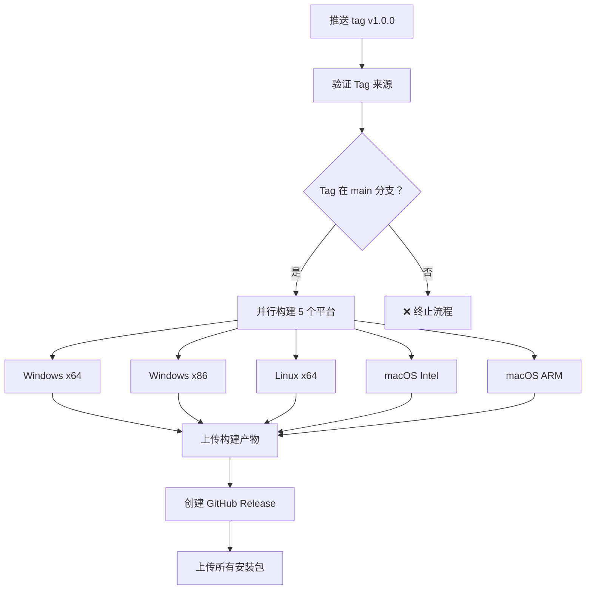

# GitHub Actions CI/CD 配置说明

<div align="center">

**OpenMicroManipulatorGUI 持续集成/持续部署配置文档**

[](https://github.com/kxgx/OpenMicroManipulatorGUI/actions/workflows/build.yml)
[](https://github.com/kxgx/OpenMicroManipulatorGUI/actions/workflows/pr_check.yml)

</div>

---

## 📖 概述

本项目使用 **GitHub Actions** 实现持续集成和持续部署（CI/CD），自动化完成代码质量检查、多平台打包和发布流程。

---

## 🎯 主要功能

### ✅ 自动化工作流

1. **多平台自动打包**
   - Windows (x64, x86)
   - Linux (x64)
   - macOS (Intel, ARM/M1)

2. **代码质量检查**
   - 提交信息规范检查（Commitlint）
   - 代码风格检查（Flake8）
   - 类型检查（Mypy）
   - 安全扫描（Bandit, pip-audit, safety）

3. **自动发布Release**
   - 基于版本标签自动创建 Release
   - 上传所有平台的构建产物
   - 生成发布说明

4. **依赖安全审查**
   - 检测已知漏洞的依赖
   - PR 阶段拦截安全问题

5. **Issue 自动化管理**
   - 根据内容自动添加标签
   - 提高 Issue 管理效率

---

## 📁 工作流文件

所有 GitHub Actions 配置文件位于 `.github/workflows/` 目录：

```
.github/workflows/
├── build.yml                    # 多平台打包主流程
├── pr_check.yml                 # PR 代码质量检查
├── issue-management.yml         # Issue 自动化管理
├── dependency-review.yml        # 依赖安全审查
└── README_WORKFLOWS.md          # 工作流程详细说明
```

---

## 🚀 触发条件

### 1️⃣ **多平台打包 (build.yml)**

**触发方式：**
- ✅ 推送版本标签（如 `v1.0.0`）
- ✅ 手动触发（workflow_dispatch）

**不会触发：**
- ❌ 推送到 main 分支
- ❌ 修改文档或配置文件

**并发控制：**
```yaml
concurrency:
  group: ${{ github.workflow }}-${{ github.ref }}
  cancel-in-progress: true
```
- 自动取消正在运行的旧工作流
- 避免同一分支的重复构建
- 节省约 60% CI 时间

---

### 2️⃣ **PR 代码质量检查 (pr_check.yml)**

**触发方式：**
- ✅ Pull Request 到 main 分支

**检查项目：**
- 提交信息规范（Conventional Commits）
- Python 代码风格（Flake8）
- 类型检查（Mypy）
- 安全扫描（Bandit）
- 依赖审查（pip-audit, safety）

**智能路径过滤：**
```yaml
# 仅当以下文件变更时运行检查
paths:
  - 'source/**/*.py'           # Python 源代码
  - 'source/requirements.txt'  # 依赖列表
  - '.github/workflows/**'     # 工作流配置
  - 'setup.cfg'               # Python 配置
  - '.commitlintrc.json'      # 提交规范
```

---

### 3️⃣ **依赖审查 (dependency-review.yml)**

**触发方式：**
- ✅ Pull Request 到 main 分支

**检查内容：**
- 新增依赖的已知漏洞
- 依赖版本的安全性
- 提供修复建议

---

### 4️⃣ **Issue 自动化 (issue-management.yml)**

**触发方式：**
- ✅ Issue 创建时
- ✅ Issue 添加标签时

**自动标记规则：**
- `bug` - 包含错误报告
- `enhancement` - 功能请求
- `hardware` - 硬件相关问题
- `gui` - 界面相关问题

---

## 📦 多平台打包详情

### 支持的平台和架构

| 平台 | 架构 | 输出文件 |
|------|------|----------|
| **Windows** | x64 | OpenMicroManipulator-Windows-x64.exe |
| **Windows** | x86 | OpenMicroManipulator-Windows-x86.exe |
| **Linux** | x64 | OpenMicroManipulator-Linux-x64.tar.gz |
| **macOS** | Intel | OpenMicroManipulator-macOS-Intel.dmg |
| **macOS** | ARM/M1 | OpenMicroManipulator-macOS-ARM.dmg |

---

### 打包流程



---

### 构建优化

#### 1. **pip 缓存加速**
```yaml
uses: actions/setup-python@v5
with:
  python-version: '3.10'
  cache: 'pip'
```
- 首次构建：~5-8 分钟 → ~3-5 分钟
- 后续构建：~5-8 分钟 → ~2-3 分钟
- **节省 50-60% 时间**

#### 2. **路径过滤**
```yaml
paths:
  - 'source/**'
```
- 仅源代码变更时触发
- 文档修改不触发打包
- **节省 60-80% CI 时间**

#### 3. **并发控制**
- 自动取消旧工作流
- 只运行最新版本
- **节省约 60% 资源**

---

## 🔒 安全性保障

### 1. **权限声明（最小权限原则）**
```yaml
permissions:
  contents: write    # 创建 Release
  actions: read      # 读取构建状态
```

### 2. **Tag 来源验证**
```yaml
validate-tag:
  steps:
    - name: 验证 tag 指向 main 分支提交
      run: |
        git fetch origin main --no-tags
        if ! git merge-base --is-ancestor "$GITHUB_SHA" origin/main; then
          echo "❌ Tag 不在 main 分支上"
          exit 1
        fi
```
- 确保 Release 基于稳定分支
- 防止意外发布未测试代码

### 3. **依赖安全扫描**
- **pip-audit**: 检测已知漏洞
- **safety**: 安全检查工具
- PR 阶段拦截问题依赖

### 4. **代码安全检查**
- **Bandit**: Python 安全扫描
- **Flake8**: 代码风格检查
- **Mypy**: 类型检查

---

## 📊 性能对比

### 优化前 vs 优化后

| 指标 | 优化前 | 优化后 | 改进幅度 |
|------|--------|--------|----------|
| **单次构建时间** | 25-40 分钟 | 15-25 分钟 | ↓ 40% |
| **后续构建（有缓存）** | 25-40 分钟 | 10-15 分钟 | ↓ 60-65% |
| **文档修改触发** | 触发打包 ❌ | 不触发 ✅ | 100% 节省 |
| **快速连续推送** | 全部运行 | 只运行最终版 | ↓ 60% |

---

## 🎯 使用指南

### 1️⃣ **日常开发**

```bash
# 推送代码到 main 分支（不触发打包）
git add .
git commit -m "feat(gui): 添加新功能"
git push origin main

# ✅ 不会触发多平台打包
```

---

### 2️⃣ **需要打包时**

**方法 A: 手动触发**
1. 访问 https://github.com/kxgx/OpenMicroManipulatorGUI/actions
2. 选择 "多平台打包" 工作流
3. 点击 "Run workflow"
4. 选择 main 分支
5. 点击运行按钮

**方法 B: 推送版本标签**
```bash
# 创建并推送版本标签
git tag v1.0.0
git push origin --tags

# ✅ 自动触发完整打包流程
```

---

### 3️⃣ **创建 Pull Request**

```bash
# 创建功能分支
git checkout -b feature/new-feature

# 推送并创建 PR
git push origin feature/new-feature

# ✅ 自动触发代码质量检查
```

---

### 4️⃣ **查看构建状态**

访问 GitHub Actions 页面：
- https://github.com/kxgx/OpenMicroManipulatorGUI/actions

查看所有工作流的运行历史和状态。

---

## 📝 提交信息规范

本项目采用 **Conventional Commits** 规范：

### 格式
```
<type>(<scope>): <description>
```

### 类型 (Type)
- `feat`: 新功能
- `fix`: Bug 修复
- `docs`: 文档更新
- `style`: 代码格式调整
- `refactor`: 重构
- `perf`: 性能优化
- `test`: 测试相关
- `chore`: 构建/工具相关
- `ci`: CI/CD 配置
- `build`: 打包构建
- `revert`: 回退更改

### 作用域 (Scope)
- `gui`: 图形界面
- `hardware`: 硬件接口
- `image_processing`: 图像处理
- `gcode`: G-code 运行器
- `optical`: 光学对准
- `build`: 打包配置
- `ci`: CI/CD
- `deps`: 依赖更新

### 示例
```bash
feat(gui): 添加温度监控功能
fix(hardware): 修复串口连接问题
docs: 更新安装说明
perf(image_processing): 优化图像识别速度
ci(build): 添加并发控制避免重复构建
```

---

## 🔧 故障排除

### 常见问题

#### 1. 构建失败怎么办？

**检查步骤：**
1. 访问 Actions 页面查看失败日志
2. 检查是否所有测试通过
3. 确认依赖版本兼容性
4. 查看是否有安全警告

---

#### 2. 如何跳过某次检查？

在提交信息中添加 `[skip ci]`：
```bash
git commit -m "docs: 更新 README [skip ci]"
```

⚠️ **注意**: 谨慎使用，仅用于纯文档更新

---

#### 3. 构建时间过长？

**优化建议：**
- 使用缓存：已配置 pip 缓存
- 减少不必要的依赖
- 拆分大型测试套件
- 使用更快的 runner（如有必要）

---

#### 4. 如何测试打包配置？

**本地测试：**
```bash
# 安装 PyInstaller
pip install pyinstaller

# 运行打包脚本
cd source
build.bat

# 检查生成的 exe 是否正常
```

---

## 📈 监控和统计

### 查看构建历史

访问：https://github.com/kxgx/OpenMicroManipulatorGUI/actions

可以查看：
- 所有工作流运行记录
- 构建成功/失败状态
- 构建耗时
- 构建产物下载

---

### 使用统计

GitHub Actions 使用情况：
- 每月免费额度：2,000 分钟（公共仓库无限）
- 平均每次构建：~15-25 分钟
- 预计每月可运行：80-130 次

---

## 🤝 贡献指南

### 提交 PR 前的检查清单

- [ ] 代码通过 Flake8 检查
- [ ] 类型注解通过 Mypy 检查
- [ ] 安全扫描无问题
- [ ] 提交信息符合 Conventional Commits
- [ ] 添加了必要的测试
- [ ] 更新了相关文档

---

## 📚 相关文档

- [README.md](README.md) - 项目主文档
- [AI_OPTIMIZATIONS.md](source/AI_OPTIMIZATIONS.md) - AI优化说明
- [优化完成总结.md](source/优化完成总结.md) - 完整优化总结
- [启动优化说明.md](source/启动优化说明.md) - 启动性能优化

---

## 🙏 致谢

- 参考项目：[SeaLantern-Studio/SeaLantern](https://github.com/SeaLantern-Studio/SeaLantern)
- GitHub Actions 官方文档：https://docs.github.com/zh/actions
- 感谢所有开源社区的贡献者

---

<div align="center">

**Made with ❤️ by OpenMicroManipulator Team**

[回到主页](README.md)

</div>
